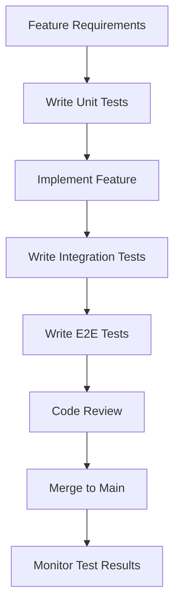

# Test Maintenance Procedures and Best Practices

## Overview

This document outlines the procedures and best practices for maintaining the test suite in the Local Business Intelligence Bot project. It covers test lifecycle management, maintenance schedules, quality assurance, and continuous improvement processes.

## Test Lifecycle Management

### 1. Test Creation Workflow

#### New Feature Development


#### Test-First Development Process
```python
# Step 1: Write failing test
class TestNewFeature:
    def test_new_functionality_success(self):
        """Test new functionality works as expected."""
        # Arrange
        service = NewFeatureService()
        input_data = "test_input"
        
        # Act
        result = service.process(input_data)
        
        # Assert
        assert result.success is True
        assert result.output == "expected_output"

# Step 2: Run test (should fail)
pytest backend/tests/unit/test_new_feature.py::TestNewFeature::test_new_functionality_success

# Step 3: Implement minimal code to make test pass
class NewFeatureService:
    def process(self, input_data: str) -> ProcessResult:
        return ProcessResult(success=True, output="expected_output")

# Step 4: Refactor and add more tests
```

#### Test Documentation Requirements
```python
class TestBusinessLogic:
    """Test suite for business logic validation.
    
    This test suite covers the core business rules and calculations
    that are critical for the application's functionality.
    
    Test Categories:
    - Calculation accuracy tests
    - Business rule validation tests
    - Edge case handling tests
    
    Dependencies:
    - Mock external services (AI APIs, Google Places)
    - Test database with isolated transactions
    
    Maintenance Notes:
    - Update tests when business rules change
    - Review performance tests quarterly
    - Validate mock responses match real API changes
    """
    
    def test_calculation_accuracy_with_edge_cases(self):
        """Test calculation handles edge cases correctly.
        
        This test is critical because calculation errors directly
        impact customer analytics and business decisions.
        
        Edge cases tested:
        - Zero reviews
        - All negative reviews
        - Mixed sentiment with time weighting
        
        Last updated: 2024-01-15
        Related requirements: REQ-001, REQ-003
        """
        pass
```

### 2. Test Modification Procedures

#### When to Update Tests
1. **Feature Changes**: Update tests when feature requirements change
2. **Bug Fixes**: Add regression tests for fixed bugs
3. **API Changes**: Update integration tests for API modifications
4. **Performance Requirements**: Update performance thresholds
5. **Security Updates**: Add security-related test cases

#### Test Update Checklist
```markdown
## Test Update Checklist

### Before Making Changes
- [ ] Identify all affected test files
- [ ] Review current test coverage for the area
- [ ] Check for dependent tests that might break
- [ ] Backup current test results for comparison

### During Updates
- [ ] Update unit tests first
- [ ] Update integration tests second
- [ ] Update E2E tests last
- [ ] Maintain test isolation
- [ ] Update test documentation
- [ ] Update mock configurations if needed

### After Updates
- [ ] Run full test suite locally
- [ ] Verify coverage hasn't decreased
- [ ] Check performance test results
- [ ] Update test documentation
- [ ] Review with team member
```

#### Breaking Change Management
```python
# Example: API endpoint change from /api/reviews to /api/v2/reviews

# Step 1: Add new tests for new endpoint
class TestReviewsV2Endpoints:
    """Tests for new v2 reviews API."""
    
    async def test_get_reviews_v2_success(self, test_client):
        response = await test_client.get("/api/v2/reviews/123")
        assert response.status_code == 200

# Step 2: Mark old tests as deprecated
class TestReviewsEndpoints:
    """Tests for legacy reviews API - DEPRECATED."""
    
    @pytest.mark.skip(reason="Legacy API deprecated, remove after v2 migration")
    async def test_get_reviews_legacy(self, test_client):
        pass

# Step 3: Remove deprecated tests after migration
# Delete TestReviewsEndpoints class after confirming v2 works
```

### 3. Test Retirement Process

#### When to Remove Tests
1. **Feature Removal**: Remove tests for deleted features
2. **API Deprecation**: Remove tests for deprecated APIs after sunset period
3. **Duplicate Coverage**: Remove redundant tests that don't add value
4. **Obsolete Technology**: Remove tests for replaced technologies

#### Safe Test Removal Procedure
```bash
# Step 1: Identify tests for removal
grep -r "deprecated\|obsolete\|TODO.*remove" backend/tests/

# Step 2: Verify tests are truly obsolete
git log --oneline -n 20 backend/tests/unit/test_obsolete_feature.py

# Step 3: Check for dependencies
grep -r "test_obsolete_feature" backend/tests/

# Step 4: Remove with documentation
git rm backend/tests/unit/test_obsolete_feature.py
git commit -m "Remove obsolete feature tests

- Feature removed in v2.0.0
- Tests no longer needed
- Coverage maintained by new v2 tests"
```

## Maintenance Schedules

### 1. Daily Maintenance (Automated)

#### CI/CD Pipeline Checks
```yaml
# .github/workflows/daily-maintenance.yml
name: Daily Test Maintenance
on:
  schedule:
    - cron: '0 2 * * *'  # Run at 2 AM daily

jobs:
  test-health-check:
    runs-on: ubuntu-latest
    steps:
      - name: Run full test suite
        run: pytest --maxfail=10
        
      - name: Check test execution time
        run: pytest --durations=10
        
      - name: Validate coverage thresholds
        run: pytest --cov=backend --cov-fail-under=80
        
      - name: Check for flaky tests
        run: pytest --count=3 --maxfail=1
        
      - name: Report results
        if: failure()
        uses: 8398a7/action-slack@v3
        with:
          status: failure
          text: "Daily test maintenance failed - investigate immediately"
```

#### Automated Test Metrics Collection
```python
# scripts/daily_test_metrics.py
import json
import time
from datetime import datetime

def collect_daily_metrics():
    """Collect daily test execution metrics."""
    metrics = {
        "date": datetime.now().isoformat(),
        "total_tests": get_total_test_count(),
        "execution_time": measure_full_suite_time(),
        "coverage_percentage": get_coverage_percentage(),
        "flaky_tests": identify_flaky_tests(),
        "slow_tests": identify_slow_tests(threshold=5.0)
    }
    
    # Store metrics for trend analysis
    with open(f"test_metrics_{datetime.now().strftime('%Y%m%d')}.json", "w") as f:
        json.dump(metrics, f, indent=2)
    
    return metrics

def identify_flaky_tests():
    """Identify tests that fail intermittently."""
    # Run tests multiple times and identify inconsistent results
    pass

def identify_slow_tests(threshold: float = 5.0):
    """Identify tests that exceed time threshold."""
    # Analyze test durations and flag slow tests
    pass
```

### 2. Weekly Maintenance (Semi-Automated)

#### Test Coverage Analysis
```python
# scripts/weekly_coverage_analysis.py
def weekly_coverage_review():
    """Perform weekly coverage analysis and reporting."""
    
    # Generate detailed coverage report
    coverage_report = generate_coverage_report()
    
    # Identify coverage gaps
    gaps = identify_coverage_gaps(coverage_report)
    
    # Check critical path coverage
    critical_path_coverage = validate_critical_paths()
    
    # Generate recommendations
    recommendations = generate_coverage_recommendations(gaps, critical_path_coverage)
    
    # Create weekly report
    create_weekly_report({
        "coverage": coverage_report,
        "gaps": gaps,
        "critical_paths": critical_path_coverage,
        "recommendations": recommendations
    })

def identify_coverage_gaps(coverage_report):
    """Identify areas with insufficient test coverage."""
    gaps = []
    
    for file_path, coverage_data in coverage_report.items():
        if coverage_data["coverage"] < 80:
            gaps.append({
                "file": file_path,
                "current_coverage": coverage_data["coverage"],
                "missing_lines": coverage_data["missing_lines"],
                "priority": calculate_priority(file_path, coverage_data)
            })
    
    return sorted(gaps, key=lambda x: x["priority"], reverse=True)
```

#### Performance Test Review
```python
# scripts/weekly_performance_review.py
def weekly_performance_analysis():
    """Analyze performance test trends and identify regressions."""
    
    # Collect performance data from last week
    performance_data = collect_weekly_performance_data()
    
    # Compare with baseline
    regressions = identify_performance_regressions(performance_data)
    
    # Update performance baselines if needed
    update_performance_baselines(performance_data)
    
    # Generate performance report
    create_performance_report(performance_data, regressions)

def identify_performance_regressions(current_data):
    """Identify performance regressions compared to baseline."""
    regressions = []
    baseline = load_performance_baseline()
    
    for test_name, current_time in current_data.items():
        baseline_time = baseline.get(test_name)
        if baseline_time and current_time > baseline_time * 1.2:  # 20% regression threshold
            regressions.append({
                "test": test_name,
                "current_time": current_time,
                "baseline_time": baseline_time,
                "regression_percent": ((current_time - baseline_time) / baseline_time) * 100
            })
    
    return regressions
```

### 3. Monthly Maintenance (Manual Review)

#### Test Suite Architecture Review
```markdown
## Monthly Test Architecture Review Checklist

### Test Organization
- [ ] Review test file sizes (max 500 lines)
- [ ] Check for test class organization (max 200 lines per class)
- [ ] Validate test method sizes (max 50 lines per method)
- [ ] Identify opportunities for test refactoring

### Test Quality
- [ ] Review test documentation completeness
- [ ] Check for proper test isolation
- [ ] Validate mock configurations are up-to-date
- [ ] Review assertion quality and specificity

### Coverage Analysis
- [ ] Analyze coverage trends over the month
- [ ] Identify persistent coverage gaps
- [ ] Review critical path coverage (must be 100%)
- [ ] Plan coverage improvement initiatives

### Performance Analysis
- [ ] Review test execution time trends
- [ ] Identify consistently slow tests
- [ ] Analyze resource usage during test runs
- [ ] Plan performance optimization initiatives

### Maintenance Needs
- [ ] Identify obsolete tests for removal
- [ ] Plan test refactoring initiatives
- [ ] Review test dependency updates needed
- [ ] Schedule test infrastructure improvements
```

#### Dependency Updates
```bash
# Monthly dependency update procedure

# Step 1: Update test dependencies
pip install --upgrade pytest pytest-asyncio pytest-cov pytest-mock

# Step 2: Update frontend test dependencies
cd frontend
npm update vitest @vue/test-utils jsdom

# Step 3: Test compatibility
pytest --co -q  # Check test collection
npm run test -- --run  # Check frontend tests

# Step 4: Update requirements files
pip freeze > requirements-test.txt
cd frontend && npm list --depth=0 > test-dependencies.txt

# Step 5: Commit updates
git add requirements-test.txt frontend/test-dependencies.txt
git commit -m "Update test dependencies - monthly maintenance"
```

### 4. Quarterly Maintenance (Strategic Review)

#### Test Strategy Review
```python
# scripts/quarterly_test_review.py
def quarterly_strategic_review():
    """Perform quarterly strategic review of test suite."""
    
    # Analyze test suite metrics over quarter
    quarterly_metrics = analyze_quarterly_metrics()
    
    # Review test categories and coverage
    coverage_analysis = perform_coverage_analysis()
    
    # Evaluate test infrastructure
    infrastructure_review = evaluate_test_infrastructure()
    
    # Plan improvements for next quarter
    improvement_plan = create_improvement_plan(
        quarterly_metrics, 
        coverage_analysis, 
        infrastructure_review
    )
    
    # Generate quarterly report
    create_quarterly_report({
        "metrics": quarterly_metrics,
        "coverage": coverage_analysis,
        "infrastructure": infrastructure_review,
        "improvement_plan": improvement_plan
    })

def analyze_quarterly_metrics():
    """Analyze test metrics over the quarter."""
    return {
        "total_tests_added": count_new_tests_this_quarter(),
        "tests_removed": count_removed_tests_this_quarter(),
        "average_execution_time": calculate_average_execution_time(),
        "flaky_test_rate": calculate_flaky_test_rate(),
        "coverage_trend": analyze_coverage_trend(),
        "performance_trend": analyze_performance_trend()
    }
```

## Quality Assurance Procedures

### 1. Test Code Reviews

#### Review Checklist
```markdown
## Test Code Review Checklist

### Code Quality
- [ ] Tests follow naming conventions (test_method_describes_behavior)
- [ ] Test methods are under 50 lines
- [ ] Test classes are under 200 lines
- [ ] Test files are under 500 lines
- [ ] Proper docstrings and comments

### Test Structure
- [ ] Follows Arrange-Act-Assert pattern
- [ ] Proper test isolation (no dependencies between tests)
- [ ] Appropriate use of fixtures
- [ ] Proper cleanup in teardown methods

### Mock Usage
- [ ] External dependencies are properly mocked
- [ ] AsyncMock used for async methods
- [ ] Mock configurations are realistic
- [ ] Mock assertions are specific and meaningful

### Coverage and Quality
- [ ] Tests cover happy path scenarios
- [ ] Tests cover error conditions
- [ ] Tests cover edge cases
- [ ] Performance requirements are tested where applicable

### Documentation
- [ ] Test purpose is clearly documented
- [ ] Complex test logic is explained
- [ ] Requirements traceability is maintained
- [ ] Maintenance notes are included where needed
```

#### Review Process
```python
# Example of good test code review feedback

# Before (needs improvement)
def test_function():
    result = service.do_something("input")
    assert result

# After (improved based on review)
def test_process_review_with_valid_input_returns_classification(self, mock_classifier):
    """Test review processing returns classification for valid input.
    
    This test validates the core review processing functionality
    which is critical for the analytics pipeline.
    """
    # Arrange
    review_text = "Great food and excellent service!"
    expected_classification = ClassificationResult(
        sentiment="positive",
        topics=["food_quality", "service"],
        confidence_score=0.95
    )
    mock_classifier.classify_review.return_value = expected_classification
    
    # Act
    result = self.service.process_review(review_text)
    
    # Assert
    assert result.sentiment == "positive"
    assert "food_quality" in result.topics
    assert result.confidence_score >= 0.9
    mock_classifier.classify_review.assert_called_once_with(review_text)
```

### 2. Test Quality Metrics

#### Automated Quality Checks
```python
# scripts/test_quality_checker.py
def check_test_quality():
    """Automated test quality validation."""
    
    quality_issues = []
    
    # Check file sizes
    oversized_files = find_oversized_test_files(max_lines=500)
    if oversized_files:
        quality_issues.extend(oversized_files)
    
    # Check test method sizes
    oversized_methods = find_oversized_test_methods(max_lines=50)
    if oversized_methods:
        quality_issues.extend(oversized_methods)
    
    # Check for missing docstrings
    missing_docstrings = find_tests_without_docstrings()
    if missing_docstrings:
        quality_issues.extend(missing_docstrings)
    
    # Check for proper assertions
    weak_assertions = find_weak_assertions()
    if weak_assertions:
        quality_issues.extend(weak_assertions)
    
    return quality_issues

def find_oversized_test_files(max_lines: int = 500):
    """Find test files that exceed line limit."""
    oversized = []
    for test_file in glob.glob("backend/tests/**/*.py", recursive=True):
        line_count = count_lines(test_file)
        if line_count > max_lines:
            oversized.append({
                "file": test_file,
                "lines": line_count,
                "max_allowed": max_lines,
                "issue": "File too large - consider splitting"
            })
    return oversized

def find_weak_assertions():
    """Find tests with weak or generic assertions."""
    weak_patterns = [
        r"assert.*is not None",
        r"assert.*== True",
        r"assert.*== False",
        r"assert len\(.*\) > 0"
    ]
    
    weak_assertions = []
    for test_file in glob.glob("backend/tests/**/*.py", recursive=True):
        with open(test_file, 'r') as f:
            content = f.read()
            for i, line in enumerate(content.split('\n'), 1):
                for pattern in weak_patterns:
                    if re.search(pattern, line):
                        weak_assertions.append({
                            "file": test_file,
                            "line": i,
                            "content": line.strip(),
                            "issue": "Weak assertion - be more specific"
                        })
    
    return weak_assertions
```

### 3. Continuous Improvement Process

#### Test Metrics Dashboard
```python
# scripts/test_metrics_dashboard.py
def generate_test_metrics_dashboard():
    """Generate comprehensive test metrics dashboard."""
    
    metrics = {
        "overview": {
            "total_tests": count_total_tests(),
            "test_categories": count_tests_by_category(),
            "execution_time": measure_total_execution_time(),
            "success_rate": calculate_success_rate()
        },
        
        "coverage": {
            "overall_coverage": get_overall_coverage(),
            "critical_path_coverage": get_critical_path_coverage(),
            "coverage_trend": get_coverage_trend(days=30),
            "uncovered_lines": get_uncovered_critical_lines()
        },
        
        "performance": {
            "average_test_time": calculate_average_test_time(),
            "slowest_tests": get_slowest_tests(limit=10),
            "performance_trend": get_performance_trend(days=30),
            "performance_regressions": identify_recent_regressions()
        },
        
        "quality": {
            "flaky_tests": identify_flaky_tests(),
            "test_debt": calculate_test_debt(),
            "maintenance_needed": identify_maintenance_needs(),
            "quality_score": calculate_quality_score()
        }
    }
    
    # Generate HTML dashboard
    generate_html_dashboard(metrics)
    
    # Send summary to team
    send_metrics_summary(metrics)
    
    return metrics

def calculate_test_debt():
    """Calculate technical debt in test suite."""
    debt_factors = {
        "oversized_files": len(find_oversized_test_files()),
        "missing_docstrings": len(find_tests_without_docstrings()),
        "weak_assertions": len(find_weak_assertions()),
        "outdated_mocks": len(find_outdated_mocks()),
        "duplicate_tests": len(find_duplicate_tests())
    }
    
    # Calculate weighted debt score
    weights = {
        "oversized_files": 3,
        "missing_docstrings": 1,
        "weak_assertions": 2,
        "outdated_mocks": 3,
        "duplicate_tests": 2
    }
    
    debt_score = sum(count * weights[factor] for factor, count in debt_factors.items())
    
    return {
        "score": debt_score,
        "factors": debt_factors,
        "severity": "high" if debt_score > 50 else "medium" if debt_score > 20 else "low"
    }
```

## Best Practices Implementation

### 1. Test Automation Standards

#### Pre-commit Hooks for Test Quality
```yaml
# .pre-commit-config.yaml
repos:
  - repo: local
    hooks:
      - id: test-file-size-check
        name: Check test file sizes
        entry: python scripts/check_test_file_sizes.py
        language: system
        files: ^backend/tests/.*\.py$
        
      - id: test-docstring-check
        name: Check test docstrings
        entry: python scripts/check_test_docstrings.py
        language: system
        files: ^backend/tests/.*\.py$
        
      - id: test-assertion-quality
        name: Check assertion quality
        entry: python scripts/check_assertion_quality.py
        language: system
        files: ^backend/tests/.*\.py$
```

#### Automated Test Generation
```python
# scripts/generate_test_templates.py
def generate_test_template(service_class: str, methods: List[str]):
    """Generate test template for new service class."""
    
    template = f'''
class Test{service_class}:
    """Test suite for {service_class}.
    
    This test suite covers the core functionality of {service_class}
    including success scenarios, error handling, and edge cases.
    """
    
    @pytest.fixture
    def mock_dependencies(self) -> Dict[str, Mock]:
        """Provide mocked dependencies for {service_class}."""
        return {{
            # Add mock dependencies here
        }}
    
    @pytest.fixture
    def service(self, mock_dependencies: Dict[str, Mock]) -> {service_class}:
        """Create {service_class} instance with mocked dependencies."""
        return {service_class}(**mock_dependencies)
'''
    
    for method in methods:
        template += f'''
    def test_{method}_success(self, service: {service_class}):
        """Test {method} succeeds with valid input."""
        # Arrange
        # TODO: Set up test data
        
        # Act
        # TODO: Call method under test
        
        # Assert
        # TODO: Verify expected behavior
        pass
    
    def test_{method}_handles_invalid_input(self, service: {service_class}):
        """Test {method} handles invalid input gracefully."""
        # Arrange
        # TODO: Set up invalid input
        
        # Act & Assert
        with pytest.raises(ValidationError):
            # TODO: Call method with invalid input
            pass
'''
    
    return template
```

### 2. Documentation Standards

#### Test Documentation Template
```python
class TestExampleService:
    """Test suite for ExampleService functionality.
    
    Purpose:
        Validates the core business logic of ExampleService including
        data processing, validation, and integration with external services.
    
    Test Categories:
        - Success path validation
        - Error handling and edge cases
        - Performance requirements
        - Integration with dependencies
    
    Dependencies:
        - Mock external APIs (Google Places, OpenAI)
        - Test database with isolated transactions
        - Mock authentication service
    
    Coverage Requirements:
        - 100% line coverage (critical path component)
        - All public methods must have tests
        - Error conditions must be tested
    
    Maintenance Notes:
        - Update tests when business rules change
        - Review mock responses quarterly
        - Performance thresholds reviewed monthly
        
    Last Updated: 2024-01-15
    Maintainer: Development Team
    Related Requirements: REQ-001, REQ-002, REQ-003
    """
    
    def test_process_data_with_valid_input_returns_expected_result(self):
        """Test data processing returns correct result for valid input.
        
        This test validates the core data processing algorithm which is
        critical for generating accurate analytics for business owners.
        
        Test Scenario:
            Given: Valid input data with proper format
            When: Processing the data through the service
            Then: Returns processed result with expected structure
        
        Business Impact:
            Failure of this functionality would prevent users from
            getting analytics insights, directly impacting user experience.
        
        Performance Requirement:
            Must complete within 500ms for datasets up to 1000 records.
        
        Last Updated: 2024-01-15
        Related Bug Reports: None
        """
        pass
```

### 3. Team Collaboration Standards

#### Test Review Process
```markdown
## Test Review Process

### Before Submitting PR
1. Run full test suite locally
2. Verify coverage hasn't decreased
3. Check test execution time hasn't increased significantly
4. Validate all new tests follow naming conventions
5. Ensure proper documentation is included

### During Code Review
1. Review test logic and assertions
2. Verify proper mock usage
3. Check test isolation and cleanup
4. Validate performance test thresholds
5. Ensure requirements traceability

### After PR Approval
1. Monitor CI/CD pipeline results
2. Check for any flaky test behavior
3. Verify coverage reports are accurate
4. Update test documentation if needed
```

#### Knowledge Sharing
```python
# Monthly test review meeting agenda template
MONTHLY_TEST_REVIEW_AGENDA = {
    "metrics_review": {
        "coverage_trends": "Review coverage changes over the month",
        "performance_trends": "Analyze test execution time trends",
        "flaky_tests": "Discuss and plan fixes for flaky tests",
        "quality_metrics": "Review test quality scores and improvements"
    },
    
    "process_improvements": {
        "automation_opportunities": "Identify manual processes to automate",
        "tool_evaluations": "Evaluate new testing tools and frameworks",
        "best_practice_updates": "Update testing guidelines and standards",
        "training_needs": "Identify team training requirements"
    },
    
    "planning": {
        "next_month_goals": "Set testing goals for next month",
        "infrastructure_improvements": "Plan test infrastructure upgrades",
        "debt_reduction": "Plan technical debt reduction initiatives",
        "resource_allocation": "Allocate time for test maintenance"
    }
}
```

This comprehensive maintenance framework ensures the test suite remains reliable, efficient, and valuable throughout the project lifecycle. Regular maintenance prevents test debt accumulation and maintains high code quality standards.